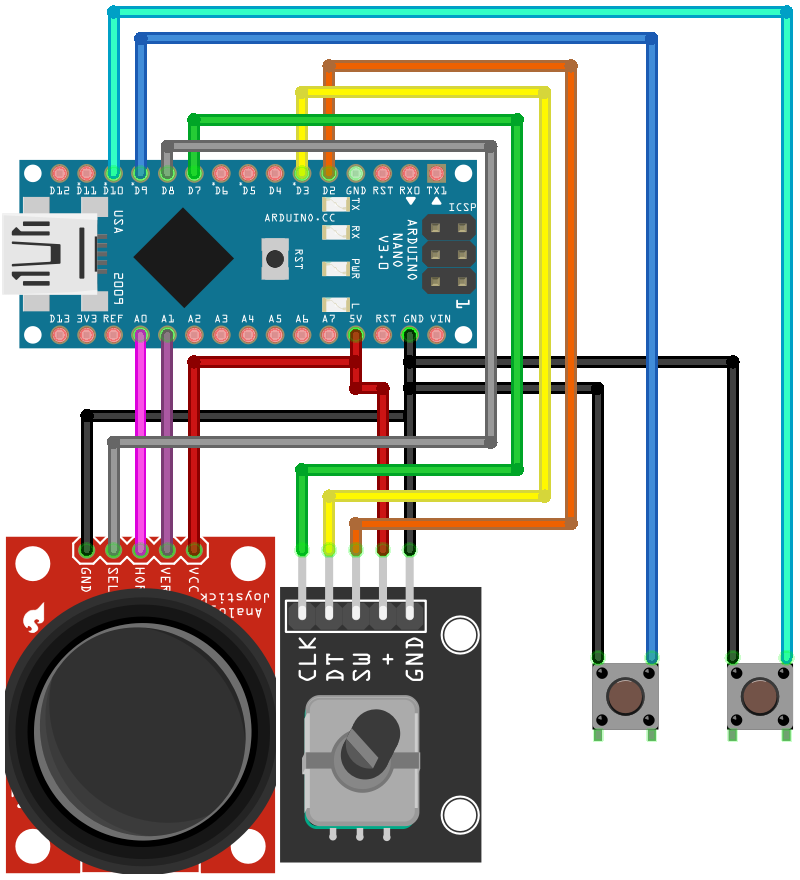

# Metro Simulator controller

## Что это

Это специальная программа которая с помощью микроконтроллера Arduino может посылать сигналы на комптютер, который в свою очередб будет нажимать необходимые клавишы

### Как запустить

1. Прошиваете Arduino
2. Подключаете её к компьютеру
3. Запускаете файл [Software.py](https://github.com/Thorgathis/MetroController/blob/master/Firmware/Firmware.ino) командой:
    - Для Windows: `py Software.py`
    - Для Linux и Mac: `python3 Software.py`
4. Выберете среди доступных COM портов, порт ардуинки
5. Готово, можно открыть блокнот и проверить все кнопки

### Нажатия

| Действие         | Клавиша |
| :--------------- | :-----: |
| Кнопка 1         |  F & G  |
| Кнопка 2         |    I    |
| Энкодер нажатие  |    E    |
| Джойстик нажатие |    Z    |
| Энкодер право    |    T    |
| Энкодер лево     |    R    |
| Джойстик вверх   |    W    |
| Джойстик вниз    |    S    |

## Распиновка

